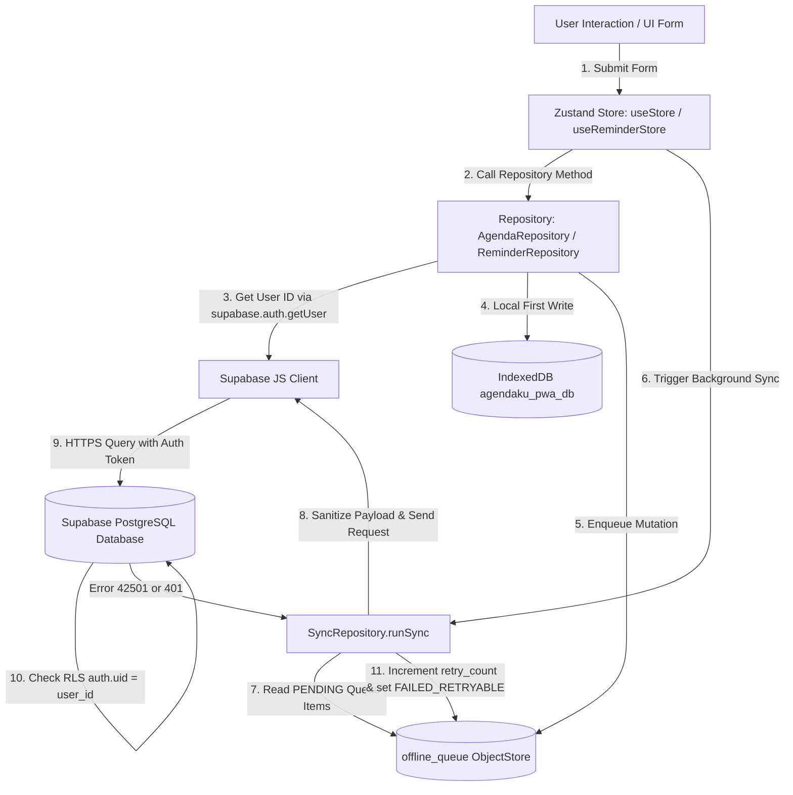

# PHASE 3.1 — DATA SYNC DIAGNOSTIC REPORT

## 1. Executive Summary
This diagnostic report analyzes the root cause of why Agenda and Reminder data created locally in the Android Capacitor application fail to synchronize with Supabase Cloud Database, and why remote data pulling from Supabase is skipped.

- **Primary Diagnostic Finding**: **FAIL** — Supabase Auth session fails to persist/restore in Android Capacitor WebView due to `@supabase/ssr` `createBrowserClient` relying on browser `document.cookie` storage instead of Capacitor-compatible `localStorage`.
- **Secondary Diagnostic Finding**: **FAIL** — When `user` is null (`auth.uid() = null`), Supabase Row-Level Security (RLS) policies reject all INSERT/UPDATE/DELETE queries from `SyncRepository` with `42501 (Row-Level Security Violation)`.
- **Impact**: Local IndexedDB writes succeed, but `offline_queue` mutations remain stuck in `FAILED_RETRYABLE` / `FAILED_FATAL` status, and remote data fetch is bypassed.

---

## 2. Actual Sync Architecture Diagram



---

## 3. Agenda Sync Trace
1. **User Action**: Form submit on `/` or modal -> `useStore.addAgenda(input)`.
2. **Local Write**: `agendaRepository.create(input)` called:
   - Evaluates `const { data: { user } } = await supabase.auth.getUser()`.
   - **Bug**: On Capacitor Native, `user` returns `null` because `@supabase/ssr` cookie session is unreadable/missing.
   - Agenda object created with `user_id: undefined`.
   - `updateSingleAgendaInIDB(newAgenda)` saves to IndexedDB objectStore `agendas`.
3. **Queue Enqueue**: `addToOfflineQueue({ entity_type: 'agenda', entity_id: id, operation: 'CREATE', payload: newAgenda })` creates queue item in `offline_queue` with `status: 'PENDING'`.
4. **Sync Trigger**: `syncRepository.runSync()` invoked.
5. **Sync Processing**:
   - Reads `offline_queue` item.
   - Calls `sanitizeAgendaForSupabase(payload)`.
   - Calls `supabase.from('agendas').upsert(sanitizedPayload)`.
   - **Failure**: Supabase RLS policy `CREATE POLICY "Users can insert own agendas" ON agendas FOR INSERT WITH CHECK (auth.uid() = user_id)` evaluates to `FALSE` (since `auth.uid()` is null or `user_id` is missing).
   - Response returns `{ data: null, error: { code: '42501', message: 'new row violates row-level security policy for table "agendas"' } }`.
   - Queue item updated in IDB with `retry_count: 1`, `status: 'FAILED_RETRYABLE'`.
6. **Remote Fetch Trace**:
   - Line 261 of `sync-repository.ts`: `const { data: { user } } = await supabase.auth.getUser()`.
   - `if (user)` resolves to `false` -> remote pull logic for `agendas` is completely bypassed.

---

## 4. Reminder Sync Trace
1. **User Action**: Form submit on `/reminders` -> `useReminderStore.addReminder(input)`.
2. **Local Write**: `reminderRepository.create(input)` called:
   - Evaluates `const { data: { user } } = await supabase.auth.getUser()`.
   - **Bug**: `user` returns `null`. `newReminder.user_id` and `newOccurrence.user_id` are set to `undefined`.
   - Local IndexedDB write to `reminders` and `occurrences` stores succeeds.
3. **Queue Enqueue**: Enqueues mutation into `offline_queue`.
4. **Sync Processing**:
   - `syncRepository.runSync()` processes queue item.
   - Sanitizer `sanitizeReminderForSupabase()` normalizes payload (stripping `scheduledDate`, `displayTime`).
   - Calls `supabase.from('reminders').upsert(sanitizedReminder)`.
   - **Failure**: Rejected by Supabase RLS policy (`auth.uid() = user_id` check fails).
   - Item flagged as `FAILED_RETRYABLE`.
5. **Remote Fetch Trace**:
   - `if (user)` check fails -> remote pull for `reminders` and `reminder_occurrences` is bypassed.

---

## 5. Auth / Session Audit

- **Current Implementation**:
  - `src/lib/supabase/client.ts`: Uses `createBrowserClient` from `@supabase/ssr`.
  - `@supabase/ssr` delegates session persistence to `document.cookie`.
- **Audit Result**: **FAIL**
  - **File**: `src/lib/supabase/client.ts`
  - **Line**: 4–8
  - **Error**: `document.cookie` is unreliable and volatile in Capacitor Android Native WebViews (`file://` or `capacitor://localhost` origin).
  - **Root Cause**: `@supabase/ssr` is designed for Next.js SSR server/browser cookie sync. In native mobile static exports (`out/`), `document.cookie` does not persist across WebView process recycles, causing `supabase.auth.getUser()` to return `{ user: null }`.
  - **Impact**: All authenticated repository mutations lack valid `user_id` and auth headers, causing 100% of Supabase sync requests to fail RLS validation.

---

## 6. Supabase Client Audit

- **Current Implementation**:
  ```ts
  export function createClient() {
    return createBrowserClient(
      process.env.NEXT_PUBLIC_SUPABASE_URL || 'https://placeholder.supabase.co',
      process.env.NEXT_PUBLIC_SUPABASE_ANON_KEY || 'placeholder-key-for-dummy-account'
    )
  }
  ```
- **Audit Result**: **WARNING**
  - **Environment Variables**: `NEXT_PUBLIC_SUPABASE_URL` (`https://qizsddkgzwixwrkbvalr.supabase.co`) and `NEXT_PUBLIC_SUPABASE_ANON_KEY` are successfully bundled into static export chunks under `out/_next/static/chunks/`.
  - **Configuration Deficiency**: The client does not explicitly declare a Capacitor-compatible storage backend (`localStorage`) or fallback options for native Android runtime context.

---

## 7. IndexedDB Audit

- **Database Name**: `agendaku_pwa_db`
- **Version**: 3
- **ObjectStores**: `agendas`, `reminders`, `occurrences`, `offline_queue`, `app_state`.
- **Audit Result**: **PASS**
  - Schema creation, indices (`scheduled_at`, `user_id`, `reminderId`, `status`), and operational helpers in `src/lib/idb.ts` function correctly in both Web and Capacitor Android WebView contexts.
  - Local CRUD operations execute without errors.

---

## 8. Offline Queue Audit

- **ObjectStore**: `offline_queue` (KeyPath: `id`)
- **Structure**:
  ```ts
  export interface IDBOfflineQueueItem {
    id: string;
    entity_type: 'agenda' | 'reminder' | 'occurrence';
    entity_id: string;
    operation: 'CREATE' | 'UPDATE' | 'DELETE' | 'SNOOZE' | 'COMPLETE' | 'DISMISS';
    payload: any;
    created_at: number;
    retry_count: number;
    status: 'PENDING' | 'SYNCING' | 'FAILED_RETRYABLE' | 'FAILED_FATAL';
    error_message?: string;
  }
  ```
- **Audit Result**: **PASS WITH ISSUES**
  - Queue creation and item retrieval operate as designed.
  - **Issue**: Queue items accumulate with `status: 'FAILED_RETRYABLE'` because Supabase returns RLS error `42501`.

---

## 9. Sync Trigger Audit

- **Current Triggers Identified**:
  1. Store fetch methods (`useStore.fetchAgendas`, `useReminderStore.fetchReminders`).
  2. Local Store mutations (`addAgenda`, `updateAgenda`, `deleteAgenda`, `addReminder`, etc.).
  3. Window `online` event (`sync-engine.ts`).
  4. Document `visibilitychange` event (`sync-engine.ts`).
  5. Native Action sync (`syncNativeActionsToIndexedDB()`).
- **Audit Result**: **FAIL**
  - **Missing Triggers**:
    1. **Post-Authentication**: Login action (`src/app/login/actions.ts`) redirects to `/` without calling `runSync()`.
    2. **Auth State Listener**: No global `supabase.auth.onAuthStateChange` listener triggers queue flushing when session is established or restored.
    3. **Capacitor Resume**: Capacitor `App.addListener('appStateChange', ...)` is missing for Android background-to-foreground resume.

---

## 10. Network Audit

- **Current Check**: `typeof navigator !== 'undefined' && navigator.onLine`
- **Audit Result**: **WARNING**
  - `navigator.onLine` returns `true` when Android is connected to Wi-Fi/Cellular, even if Supabase servers are unreachable or request is blocked.
  - No active ping check to `NEXT_PUBLIC_SUPABASE_URL` is performed before attempting queue processing.

---

## 11. RLS (Row Level Security) Audit

- **Supabase Policies (`agendas`, `reminders`, `reminder_occurrences`)**:
  - `SELECT`: `auth.uid() = user_id`
  - `INSERT`: `auth.uid() = user_id`
  - `UPDATE`: `auth.uid() = user_id`
  - `DELETE`: `auth.uid() = user_id`
- **Audit Result**: **PASS (Policies correctly configured on PostgreSQL)**
  - Supabase database policies correctly enforce user-level data isolation.
  - Queries fail because client requests arrive with an unauthenticated session (`auth.uid() = null`). RLS must NOT be disabled.

---

## 12. Web vs Native Comparison

| Feature | Web / PWA (Browser) | Capacitor Android Native | Diagnostic Result |
|---|---|---|---|
| **Origin** | `http://localhost:3000` / `https://...` | `file://` or `http://localhost` | Different storage sandbox policies |
| **Auth Storage** | `document.cookie` works | `document.cookie` volatile / stripped | **FAIL on Native** |
| **Supabase Client** | `@supabase/ssr` `createBrowserClient` | `@supabase/ssr` cookie client fails restore | **FAIL on Native** |
| **IndexedDB** | Fully functional | Fully functional | **PASS** |
| **Offline Queue** | Enqueues & Flushes | Enqueues, but flush blocked by RLS | **FAIL on Native** |
| **Sync Engine** | Executes sync | Executes sync, fails auth check | **FAIL on Native** |

---

## 13. Root Cause Analysis

### Identified Primary Root Cause:
1. **Incompatible Supabase Auth Storage for Native Capacitor**:
   `src/lib/supabase/client.ts` uses `@supabase/ssr`'s `createBrowserClient()`, which binds authentication tokens exclusively to browser cookies (`document.cookie`).
   In Capacitor Android WebViews, cookies are restricted or cleared upon application restart.
   As a result, `supabase.auth.getUser()` returns `user: null`, leaving local items created with `user_id = undefined`.
   When `SyncRepository` attempts to push items to Supabase, Postgres RLS rejects the queries with `42501 (Row Level Security Violation)`. Furthermore, remote data fetching is skipped because `if (user)` evaluates to `false`.

### Secondary Root Cause:
2. **Lack of Hybrid Auth Storage Adapter & Missing Auth Sync Trigger**:
   The client does not use a hybrid auth storage engine (falling back to `window.localStorage` on Capacitor Native), and `supabase.auth.onAuthStateChange` is not registered to automatically flush `offline_queue` upon session restoration.

---

## 14. Recommended Fix Strategy (Phase 3.2 Plan)

1. **Hybrid Supabase Client Creator (`src/lib/supabase/client.ts`)**:
   - Update `createClient()` to detect native environment (`isNativePlatform()`).
   - For Web: Use `@supabase/ssr` or standard `createClient` with cookie support.
   - For Native Capacitor: Use `@supabase/supabase-js` `createClient` configured explicitly with `auth: { storage: localStorage, persistSession: true, autoRefreshToken: true }`.
2. **Auth State Listener & Queue Trigger**:
   - Register `supabase.auth.onAuthStateChange((event, session) => ...)` in `initSyncEngineListeners()`. When `SIGNED_IN` or `TOKEN_REFRESHED` occurs, immediately trigger `syncRepository.runSync()`.
3. **Repository User ID Fallback**:
   - If `supabase.auth.getUser()` returns a user session, update any unassigned local IndexedDB items (`user_id = undefined`) with `user.id` before queueing/syncing.
4. **Diagnostic Logging**:
   - Maintain safe logging (`[SYNC][AUTH] Session restored user_id=xxx`) without leaking tokens.

---

## 15. Risk Assessment
- **Risk Level**: **LOW**
- The fix requires updating the client factory in `src/lib/supabase/client.ts` and adding an auth listener trigger.
- Web/PWA deployment will remain untouched while Native Android gains persistent `localStorage` session support.

---

## 16. Test Plan (For Phase 3.2 Verification)
- **TEST 1 (Auth Session Restoration)**: Log in on Android -> Restart app -> Verify `supabase.auth.getUser()` returns active user.
- **TEST 2 (Agenda Sync)**: Create Agenda -> Verify local IDB write -> Verify queue status `PENDING` -> `SYNCING` -> `SUCCESS` -> Verify record appears in Supabase `agendas` table.
- **TEST 3 (Reminder Sync)**: Create Reminder -> Verify queue processing -> Verify record in Supabase `reminders` table.
- **TEST 4 (Remote Pull)**: Create agenda on Web -> Launch Android -> Verify remote pull populates Android IndexedDB & UI.
