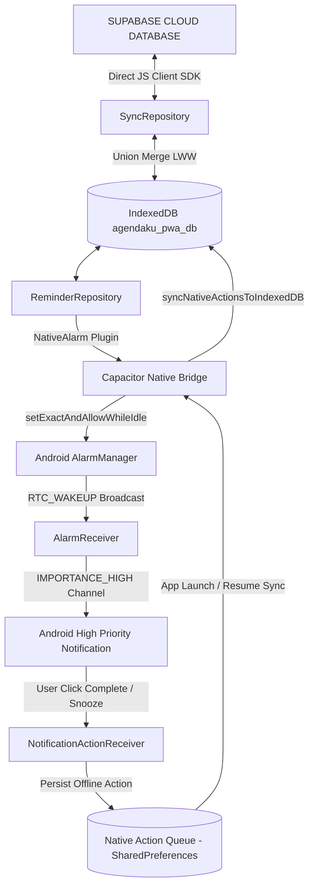

# PHASE 3 — NATIVE ALARM & NOTIFICATION ARCHITECTURE

## System Architecture Diagram

---

## Technical Specifications

### 1. AlarmManager Strategy
- **Trigger**: Exact Alarm via `AlarmManager.setExactAndAllowWhileIdle(AlarmManager.RTC_WAKEUP, scheduledAtMs, pendingIntent)`.
- **Target SDK**: Android 14+ (API 34) compatible with `SCHEDULE_EXACT_ALARM` & `USE_EXACT_ALARM`.
- **PendingIntent**: Deterministic hash algorithm based on `Math.abs(occurrenceId.hashCode())` ensuring exact 1:1 replacement upon updates/reconciliations.

### 2. High-Importance Notification Channel
- **Channel ID**: `agendarecap_reminder_channel_[soundKey]`
- **Importance**: `NotificationManager.IMPORTANCE_HIGH`
- **Audio Usage**: `AudioAttributes.USAGE_ALARM`
- **Actions**:
  - `❌ CLOSE / COMPLETE`: Cancels notification & enqueues `COMPLETE` action to `NativeActionStorage`.
  - `⏱ 5 MIN`: Snoozes occurrence by 5 minutes, reschedules `AlarmManager`, and enqueues `SNOOZE` action.
  - `⏱ 15 MIN`: Snoozes occurrence by 15 minutes, reschedules `AlarmManager`, and enqueues `SNOOZE` action.

### 3. Native Offline Action Queue (`NativeActionStorage.java`)
- **Storage**: SharedPreferences (`agendarecap_native_actions`).
- **Persistence**: User action clicks are stored immediately on native side without depending on WebView / JavaScript process state.
- **Import Loop**: On application launch / resume, `syncNativeActionsToIndexedDB()` reads pending native actions, applies them to IndexedDB via `ReminderRepository`, acknowledges and removes them from native storage, and triggers Supabase sync.

### 4. Boot Recovery (`BootReceiver.java`)
- Receives `BOOT_COMPLETED`, `MY_PACKAGE_REPLACED`, `QUICKBOOT_POWERON`.
- Reads `AlarmStorage` and re-registers future alarms directly with `AlarmManager` before user launches Next.js UI.
