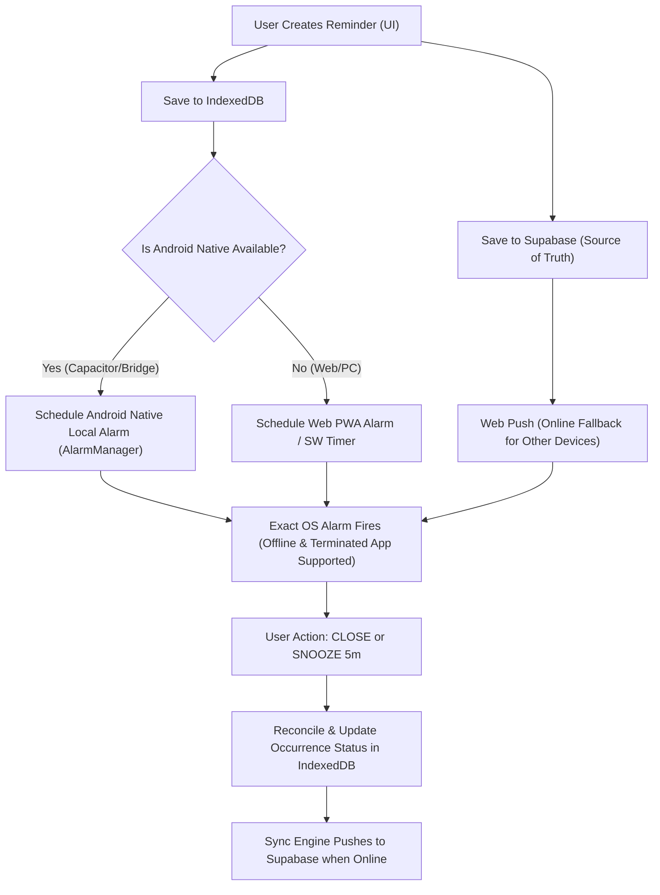

# Technical Audit Diagnosis & Hybrid Alarm Architecture Plan

## Executive Summary
This document provides a comprehensive technical audit of the current **AgendaRecap Pro** codebase, diagnoses why the previous Web Push & reminder engine fell short of acting like a true **ALARM**, and outlines the blueprint for the new **Hybrid Alarm Engine** with native Android offline support.

---

## 1. Root Cause Diagnosis (Akar Masalah Implementasi Sebelumnya)

| Problem Area | Diagnosis & Root Cause | Impact |
| :--- | :--- | :--- |
| **Pure Web Push Limitation** | Web Push relies on the browser vendor's push service (FCM/Mozilla Push) and an active internet connection. When the device is **offline** and the app/browser is **terminated**, pure Web Push **cannot deliver notifications**. | Reminders fail when the device is offline or when browser background processes are killed by Android OS battery optimization. |
| **Vercel Cron Execution Frequency** | `vercel.json` was configured with `"schedule": "0 8 * * *"` (running once daily at 08:00 UTC). On Vercel Hobby plans, cron jobs cannot run every minute natively. | Production Web Push triggers were not executing every minute. |
| **Snooze Master Schedule Corruption** | In `src/app/api/reminders/[id]/snooze/route.ts`, snooze actions modified `reminders.time` directly (`UPDATE reminders SET time = newTime`). | Snoozing a reminder corrupted the master schedule (`08:00` became `08:05`). Next week's occurrence was wrongfully set to `08:05`. |
| **Lack of OS Native AlarmManager** | The application had no native Android layer (`AlarmManager` / `@capacitor/local-notifications`) to schedule OS-level exact alarms that fire even when offline and terminated. | Chrome/Edge PWAs on Android suspended background timers when killed. |
| **Cache Buildup** | SW cache versions needed strict lifecycle cleanup so old static shells (`v1`, `v2`, `v3`, `v4`) don't linger. | Outdated SW scripts occasionally handled push actions. |

---

## 2. New Hybrid Architecture Blueprint

---

## 3. Data Model Refactoring (Master vs Occurrence)

### **Reminders Table (Master Definition)**
- `id`: UUID (Primary Key)
- `title`: TEXT
- `body`: TEXT (Pengguna's custom notes: *"Jangan lupa membawa dokumen evaluasi dan laptop."*)
- `time`: TEXT (e.g. `'08:00'`)
- `timezone`: TEXT (`'Asia/Jakarta'`)
- `frequency`: TEXT (`'once'`, `'daily'`, `'weekdays'`, `'weekly'`)
- `days_of_week`: INT[]
- `sound`: TEXT
- `is_active`: BOOLEAN
- `delivery_mode`: TEXT (`'auto'`, `'native'`, `'push'`, `'calendar'`)

### **Reminder Occurrences Table (Execution Instance)**
- `id`: UUID (Primary Key)
- `reminder_id`: UUID (FK -> `reminders.id`)
- `scheduled_at`: TIMESTAMPTZ (Exact scheduled UTC timestamp)
- `status`: TEXT (`'scheduled'`, `'processing'`, `'sent'`, `'snoozed'`, `'completed'`, `'dismissed'`, `'cancelled'`, `'failed'`)
- `snoozed_until`: TIMESTAMPTZ (Populated when user clicks **SNOOZE**)
- `notification_tag`: TEXT (`'agenda-{reminderId}-{occurrenceId}'`)

> **Critical Rule:** Snooze ONLY updates `snoozed_until` & `status` on the active occurrence. The master `time` (`08:00`) remains strictly unchanged!

---

## 4. Native Android Alarm Bridge (Capacitor Integration)

To guarantee exact alarms on Android when offline and terminated:
1. **Capacitor Core & Local Notifications:** Integrate `@capacitor/core`, `@capacitor/android`, and `@capacitor/local-notifications`.
2. **Native Alarm Manager:** Use Capacitor's `LocalNotifications.schedule()` which hooks directly into Android OS `AlarmManager` with `exact: true`.
3. **Action Buttons:**
   - `[ CLOSE ]` -> Marks occurrence `completed` / `dismissed`.
   - `[ SNOOZE 5 MIN ]` -> Schedules local native alarm +5 minutes.
4. **Android Permissions & UX:** Request `POST_NOTIFICATIONS` and direct user to `SCHEDULE_EXACT_ALARM` settings if needed.

---

## 5. Offline-First IndexedDB & Sync Engine

1. **IndexedDB Stores:**
   - `reminders`
   - `occurrences`
   - `offline_queue`
   - `device_settings`
   - `notification_state`
2. **Sync Engine:**
   - UPSERT with `updated_at` & idempotency keys.
   - Triggers automatically on `online` event & `visibilitychange`.
   - Flushes queued mutations to Supabase and pulls remote changes.

---

## 6. Service Worker v5 & Cache Cleanup

1. **Cache Version:** `agendaku-pwa-v5`.
2. **Activation:** Deletes all obsolete caches (`v1` through `v4`).
3. **Zero-OPEN Action Handling:** Notification action buttons strictly process `CLOSE` and `SNOOZE` via background API fetch or IndexedDB queue without opening browser windows.

---

## 7. Diagnostic Panel & Status UI (`/settings/notifications`)

Comprehensive diagnostics page showing:
- Platform / OS / Browser environment
- Notification Permission: `GRANTED` / `DENIED`
- Exact Alarm Permission (Android): `GRANTED` / `DENIED`
- Local Alarm Engine: `NATIVE ALARM ACTIVE` / `PWA FALLBACK`
- Push Subscription & VAPID status
- IndexedDB & Sync Queue stats
- Direct Test Actions:
  - `[ TEST LOCAL ALARM ]` (Triggers +5 second native/local alarm)
  - `[ TEST PUSH ]`
  - `[ TEST NATIVE NOTIFICATION ]`
  - `[ TEST SYNC ]`
  - `[ CLEAR STALE CACHE ]`
  - `[ CANCEL ALL LOCAL ALARMS ]`

---

## 8. Implementation Steps & Milestones

- [x] **Phase 1:** Complete Repository Audit & Diagnosis
- [ ] **Phase 2:** Refactor Data Model & Snooze logic (prevent Master Schedule corruption)
- [ ] **Phase 3 & 4:** Implement Android Native Local Alarm Layer & Capacitor Bridge
- [ ] **Phase 5 & 6 & 7:** Service Worker v5 Upgrade & Zero-OPEN CLOSE/SNOOZE Handlers
- [ ] **Phase 8 & 9 & 10:** IndexedDB Schema Expansion, Cache Cleanup, & Sync Engine Polish
- [ ] **Phase 14 & 15:** Calendar Export Integration & Alarm Mode UI (AUTO, NATIVE, PUSH, CALENDAR)
- [ ] **Phase 16:** Diagnostic Panel Implementation (`/settings/notifications` & `/diagnostics`)
- [ ] **Phase 17 - 20:** Local Verification, Android Offline Alarm Test, & Production Build Validation
